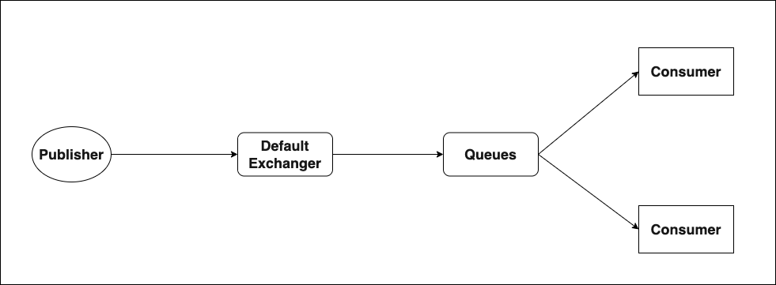

# RabbitMQ Test Project Using NodeJs

### Architecture
This is the my sample code architecure diagram:


-  Creating RabbitMQ server with Docker
`docker pull rabbitmq:management`

- Running Docker image of RabbitMQ
`docker run -d -p 5672:5672 -p 15672:15672 --name rabbitmq-server rabbitmq:management`

- Management portal at http://localhost:15672/ (Creds: guest/guest)

- Run Publisher and Consumer
```
node publisher.js
node consumer.js
```
